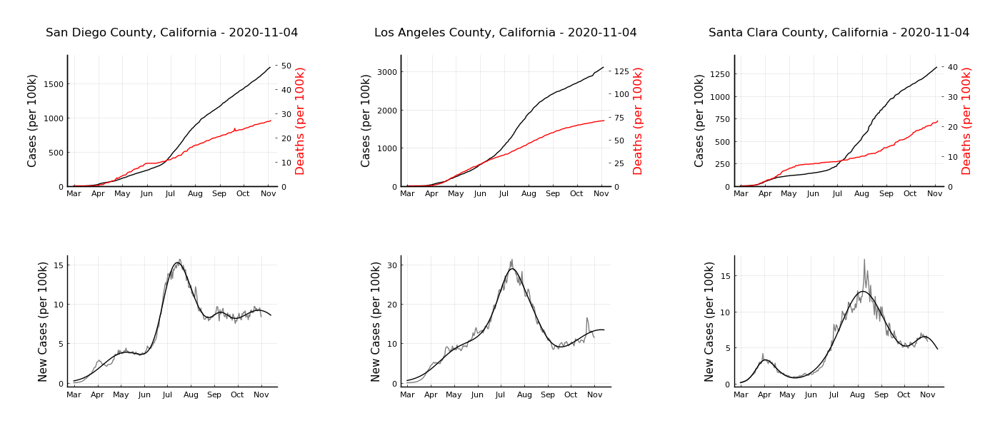

# Covid19Analysis
Scripts to plot and analyze covid-19 case data by county.

## Data sources
* Daily covid-19 cases and deaths data are from the [NY Times covid-19 data set](https://github.com/nytimes/covid-19-data).
* County populations are from the [U.S. Census Bureau 2019 estimates](https://www.census.gov/data/tables/time-series/demo/popest/2010s-counties-total.html).

## Getting started
* Install [Julia](https://julialang.org). You may need to consult the [instructions here](https://julialang.org/downloads/platform/).
* It is highly recommended to run the following command to automatically update git submodules.
> git config --global submodule.recurse true
* Initialize the submodule that contains all of the data.
> git submodule update --init --recursive
* After the submodule is updated, just run
> julia analyze_data.py

## Example output

