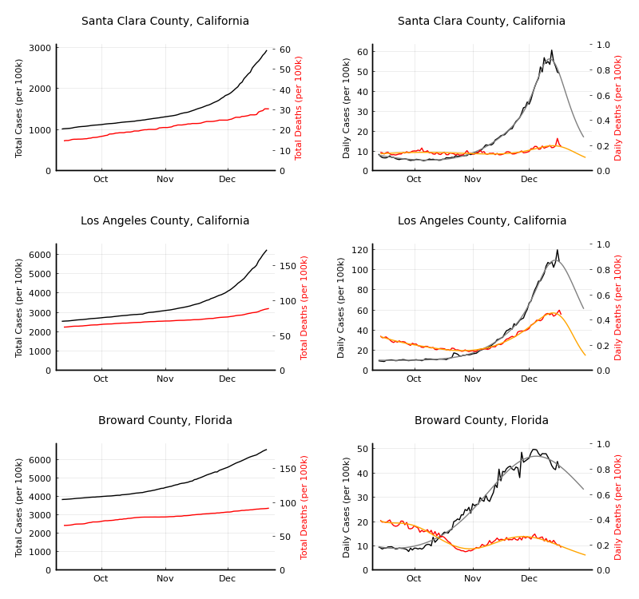

# Covid19Analysis
Scripts to plot and analyze covid-19 case data by county.

## Data sources
* Daily covid-19 cases and deaths data are from the [NY Times covid-19 data set](https://github.com/nytimes/covid-19-data).
* County populations are from the [U.S. Census Bureau 2019 estimates](https://www.census.gov/data/tables/time-series/demo/popest/2010s-counties-total.html).

## Getting started
* It is highly recommended to run the following command to automatically update git submodules.
> git config --global submodule.recurse true
* After the submodule (containing the data) is updated, just run
> python3 analyze_data.py

## Example output

